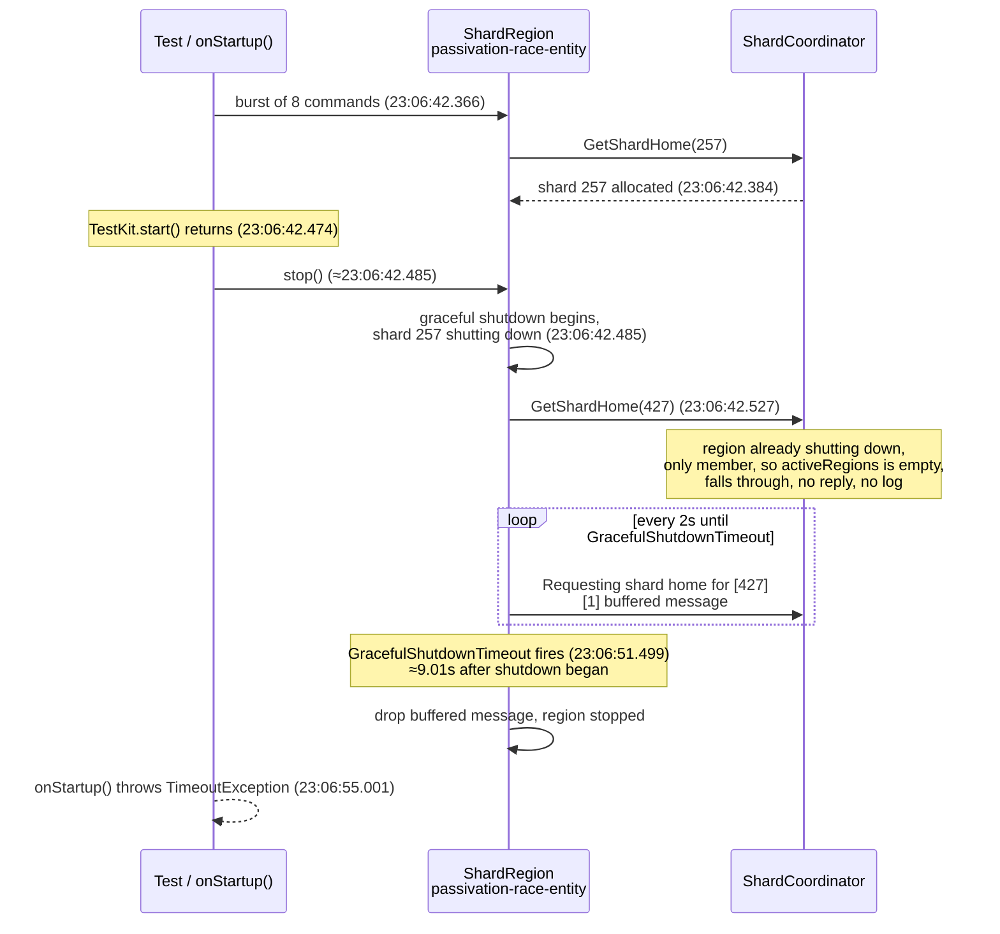

# akka-testkit-race-repro

A standalone reproduction of a stall in TestKit runtime shutdown. A service that sends a burst of
commands to a sharded EventSourcedEntity can leave one message buffered in a shard region that
never gets a shard home, and stopping the runtime then waits about nine seconds for it. Sending
that burst from `ServiceSetup.onStartup()` makes the stall common rather than rare, because
`start()` does not wait for the hook and the commands are still in flight when the caller stops
the runtime. Related upstream issues:
[akka-core#33001](https://github.com/akka/akka-core/issues/33001) and
[lightbend/akka-runtime#5719](https://github.com/lightbend/akka-runtime/issues/5719).

The stall is only visible against Akka jars carrying the fixes listed under "Observed on a patched
jarset". On the released jars an ordinary stop() takes about a second, which hides it. A further
change to `ShardRegion`, built on top of those, removes the stall; see the last section.

The project carries no business logic. It holds one bare entity, three projections over it, a
`ServiceSetup` whose startup hook sends a small burst of commands to that entity, and one test that
cycles the TestKit runtime and prints how long each start and each stop took. "The same gap, direct
against akka-core" below reproduces it a second way, with `ClusterSharding` used directly and no
Akka SDK involved at all.

## Components

| Class | What it is for |
|---|---|
| `repro.PassivationRaceEntity` | A bare `EventSourcedEntity<String, Event>` with one start/get command pair |
| `repro.PassivationRaceView` | A view over the entity's events. The query is never called |
| `repro.PassivationRaceConsumers` | Two consumers over the same events, handlers that ignore them |
| `repro.Bootstrap` | The `ServiceSetup` whose `onStartup()` sends the burst |

The view and the two consumers give the entity three sharded daemon process coordinators rather
than one, which is the fan-out a real service reaches quickly. A coordinator is created per
registered projection whatever its handler does with an event, so the handlers here are empty.

## The test

`repro.BootstrapWorkTimingTest` runs three arms, fifteen start/stop cycles each, and prints the
wall-clock duration of every start and every stop:

- `withBurstFromOnStartup` sends the burst from inside `onStartup()`.
- `withoutBurstFromOnStartup` is the baseline. No burst is sent.
- `withBurstAfterStartReturns` sends the same burst from the test, once `start()` has returned and
  the cluster is already up.

The arms differ only in whether the burst runs and where it is issued from. Which arm a run uses is
configuration, `repro.onstartup-burst.enabled` in `src/main/resources/application.conf`, so one
build runs all three.

There is no assertion. Read the printed numbers. The finding is the shape of the stop()
distribution, a flat baseline against occasional multi-second spikes, not a pass or a fail.

## Build and run

The Akka artifacts are not on Maven Central. Resolving them needs the Akka repository, whose URL is
obtained from <https://account.akka.io/token>.

```bash
mvn test -Dtest=BootstrapWorkTimingTest
```

Run it under `caffeinate -d -i -s` on macOS. The printed durations come from `nanoTime`, which does
not advance while the machine sleeps, but the run is long enough to be worth protecting.

To see the shard lookups around a stalled cycle, keep the output and count them:

```bash
caffeinate -d -i -s mvn test -Dtest=BootstrapWorkTimingTest > run.log 2>&1
grep -c "Requesting shard home for" run.log
```

A per-cycle shard lookup is normal. The stop() duration is what to read.

## Running against a patched jarset

The numbers below separate into two groups depending on which Akka build the test runs against.
To run against a local build of the Akka jars, put them in a repository of their own and use it as
the head of a split repository, leaving the shared one as the tail:

```bash
mvn test -Dtest=BootstrapWorkTimingTest \
  -Dmaven.repo.local=/path/to/patched/repo \
  -Dmaven.repo.local.tail="$HOME/.m2/repository"
```

Confirm which artifacts the run resolved before reading any numbers:

```bash
mvn dependency:tree -Dmaven.repo.local=... -Dmaven.repo.local.tail=... | grep akka-cluster
```

## Observed on the released jars

akka-javasdk 3.6.3 with the artifacts it resolves from Maven, JDK 27, macOS. Milliseconds per
cycle:

```
[baseline, no burst]
start(): [3235, 1717, 1671, 223, 1664, 232, 1647, 1667, 1663, 1658, 1656, 1642, 1643, 1633, 1644]
stop():  [1090, 1035, 1036, 1185, 1034, 2198, 1026, 1026, 1023, 1025, 1027, 1034, 1028, 1025, 1025]

[burst after start() returns]
start(): [1627, 193, 1636, 1633, 1631, 1633, 1632, 1650, 1658, 1631, 1626, 1641, 1662, 1642, 1638]
stop():  [1042, 1027, 1031, 1026, 1030, 1024, 1027, 1022, 1022, 1029, 1024, 1031, 1028, 1030, 1026]

[burst from onStartup()]
start(): [1634, 1643, 1645, 1638, 1649, 1635, 172, 1644, 1623, 1631, 1627, 1620, 1632, 1648, 1639]
stop():  [1025, 1025, 1034, 1029, 1025, 1025, 2198, 1026, 1025, 1026, 1027, 1035, 1032, 1028, 1027]
```

Every stop() sits near one second and the longest is 2.2 seconds. That floor is high enough to hide
a longer stall, and the 2.2 second outlier appears in the baseline arm too, so these numbers do not
separate the arms.

## Observed on a patched jarset

The same test against a local build carrying akka-core
[#32997](https://github.com/akka/akka-core/pull/32997),
[#32998](https://github.com/akka/akka-core/pull/32998) and
[#33000](https://github.com/akka/akka-core/pull/33000), akka-projection
[#1457](https://github.com/akka/akka-projection/pull/1457) and akka-runtime
[#5718](https://github.com/lightbend/akka-runtime/pull/5718), resolved as akka-runtime 1.6.15,
akka-cluster 2.10.20 and akka-projection 1.6.20. Two runs of all three arms:

```
[baseline, no burst]
stop() run 1: [163, 1257, 1265, 1247, 226, 1249, 1237, 1247, 228, 217, 1225, 1248, 1248, 218, 1238]
stop() run 2: [1163, 226, 226, 1257, 1247, 245, 1269, 1244, 1237, 237, 236, 226, 1248, 1235, 1250]

[burst after start() returns]
stop() run 1: [7, 7, 5, 8, 5, 5, 12, 10, 11, 7, 10, 6, 12, 16, 5]
stop() run 2: [11, 10, 10, 12, 9, 5, 10, 13, 4, 5, 12, 6, 9, 7, 13]

[burst from onStartup()]
stop() run 1: [1238, 1249, 9027, 1240, 1237, 1248, 1258, 1248, 1247, 217, 228, 1238, 1247, 1246, 1238]
stop() run 2: [1246, 227, 9028, 249, 1246, 1238, 1238, 1249, 219, 238, 218, 228, 1237, 1278, 1238]
```

The patched jars take the ordinary stop() down to single digit milliseconds, which is what makes
the stall visible: a cycle of about 9.03 seconds against a floor of about 8 milliseconds, at the
same cycle in both runs.

## Which patch the stall needs

Bisecting the five patches above against `withBurstFromOnStartup`, with `harness.sh --patched`,
akka-projection and akka-runtime left at their released versions throughout:

| akka-core patches carried | akka-projection / akka-runtime | Runs × cycles | Stalled cycles | Ordinary stop() |
|---|---|---|---|---|
| [#32997](https://github.com/akka/akka-core/pull/32997) + [#32998](https://github.com/akka/akka-core/pull/32998) | released | 3 × 15 = 45 | 0 | ~15-20ms |
| [#32997](https://github.com/akka/akka-core/pull/32997) + [#32998](https://github.com/akka/akka-core/pull/32998) + [#33000](https://github.com/akka/akka-core/pull/33000) | released | 4 × 15 = 60 | 4 | ~1.25s |
| [#33000](https://github.com/akka/akka-core/pull/33000) alone | released | 4 × 15 = 60 | 3 | ~2.2-2.3s |

**[#33000](https://github.com/akka/akka-core/pull/33000) ("retry singleton identification from
proxy with backoff") is the whole requirement.** Alone, with neither of the other two akka-core
patches and neither of the non-core ones, it reproduces the same 9.0-10.0-second stall at the same
rate as every combination that includes it, roughly one cycle in 15 to 20.
[#32997](https://github.com/akka/akka-core/pull/32997) and
[#32998](https://github.com/akka/akka-core/pull/32998) only change how fast an ordinary,
non-stalled stop() completes: with them and without [#33000](https://github.com/akka/akka-core/pull/33000), the whole eight-command burst finishes
inside onStartup() in about 180 milliseconds, before start() returns, so there is nothing left in
flight for a stop() to race against, and 45 cycles produced no stall at all.

This is not a defect in [#33000](https://github.com/akka/akka-core/pull/33000) itself, and none of
these three patches put the buffered message where it ends up. What
[#33000](https://github.com/akka/akka-core/pull/33000) changes is timing elsewhere in singleton
identification, and that shift is enough to make the burst still be in flight when `onStartup()`
returns and the caller calls `stop()`. Without it, in these builds, the burst always finishes first
and the race never gets an opening. The bug this exposes is in the region and coordinator, read in
full under "Where the root cause is likely to be": a `GetShardHome` the coordinator can never answer
once the only region has asked to shut down, and a region that then waits out a full phase timeout
for a reply that cannot come. That bug is present with or without [#33000](https://github.com/akka/akka-core/pull/33000). The patch just widens the window this particular repro needs
to land a command inside it; a service whose own startup work is slower, or whose commands cross the
network, would not need it at all.
[akka-projection#1457](https://github.com/akka/akka-projection/pull/1457) and
[akka-runtime#5718](https://github.com/lightbend/akka-runtime/pull/5718) were never in any of these
three builds and the stall reproduces without them just as it does with them.

## What the stall is

The sequence below is the same stalled cycle as the log excerpts that follow it, with the
timestamps from that log. The coordinator receives the request for shard 427 but never answers it,
because by then the region has already asked to shut down and, as the only member, there is no
other region the shard could be allocated to.



The snippets below are from one stalled cycle of `withBurstFromOnStartup`, at debug level, in
`logs/20260922-230636/withBurstFromOnStartup-run1.log`. The runs behind every number in this file
are committed under `logs/`, one directory per harness invocation, each with the dependency tree
the run resolved. Timestamps are kept so the gaps are readable.

The hook is not awaited. The burst starts, `start()` returns while it is still issuing, and the
test calls `stop()` about ten milliseconds later:

```
23:06:42.365 INFO  akka.runtime.DiscoveryManager - Akka Runtime started at 127.0.0.1:53267
23:06:42.366 INFO  repro.Bootstrap - onStartup burst of 8 starting
23:06:42.474 INFO  akka.javasdk.testkit.TestKit - Runtime started
23:06:42.485 DEBUG a.c.sharding.DDataShardCoordinator - passivation-race-entity: Graceful shutdown of region [...] with [1] shards
```

`onStartup burst of 8 done` is logged zero times in the run, against fifteen `starting` lines. No
cycle ever finishes its burst.

One command had reached a shard. The rest were still in flight when shutdown began, and one of
them asks for a shard home after the region has already started shutting down:

```
23:06:42.384 DEBUG a.c.sharding.DDataShardCoordinator - passivation-race-entity: Shard [257] allocated at [...]
23:06:42.485 INFO  a.c.sharding.DDataShardCoordinator - passivation-race-entity: Starting shutting down shards [257] due to region shutting down or explicit stopping of shards.
23:06:42.527 DEBUG akka.cluster.sharding.ShardRegion - passivation-race-entity: Request shard [427] home. Coordinator [Some(...)]
```

Shard 427 is never allocated. The coordinator logs nothing further about it, and the region retries
every two seconds, holding the one message it cannot deliver:

```
23:06:44.128 DEBUG akka.cluster.sharding.ShardRegion - passivation-race-entity: Requesting shard home for [427] from coordinator at [...]. [1] buffered messages.
23:06:46.149 DEBUG akka.cluster.sharding.ShardRegion - passivation-race-entity: Requesting shard home for [427] ... [1] buffered messages.
23:06:48.169 DEBUG akka.cluster.sharding.ShardRegion - passivation-race-entity: Requesting shard home for [427] ... [1] buffered messages.
23:06:50.188 DEBUG akka.cluster.sharding.ShardRegion - passivation-race-entity: Requesting shard home for [427] ... [1] buffered messages.
23:06:51.499 WARN  akka.cluster.sharding.ShardRegion - passivation-race-entity: Graceful shutdown of shard region timed out, region will be stopped. Remaining shards [], remaining buffered messages [1].
```

That is the stalled cycle: about nine seconds from the shutdown request to the region giving up,
against about eight milliseconds when nothing is buffered. Shutdown then proceeds normally:

```
23:06:51.499 DEBUG akka.cluster.sharding.ShardRegion - passivation-race-entity: Region stopped
23:06:51.500 DEBUG akka.actor.CoordinatedShutdown - Performing phase [cluster-leave] with [1] tasks.
```

The command that was buffered fails the hook, with the error the service under investigation
reported:

```
23:06:55.001 ERROR repro.Bootstrap - onStartup() threw an exception
java.util.concurrent.TimeoutException: Command to entity [passivation-race-entity] id [d9031920-...] timed out.
```

So the sequence is: a command arrives for a shard that has no home yet, the region buffers it and
asks the coordinator, shutdown of that region begins before the answer comes, the answer never
comes, and graceful shutdown waits out its timeout for a message that cannot be delivered.

`onStartup()` makes this common because `start()` does not wait for the hook. The burst is still
issuing when the caller believes startup is finished, so a caller that stops the runtime promptly
stops it with commands in flight. A burst issued after `start()` returns is fully delivered before
`stop()` is called, which is why that arm rarely stalls.

## What the runs support

Every sample below comes from `./harness.sh` against the patched jarset, one arm per JVM. A stall
is a cycle whose `stop()` exceeded nine seconds; each one is accompanied by exactly one of the
warnings above, and no run produced that warning without a stall.

| Arm | Runs | Cycles | Stalled cycles |
|---|---|---|---|
| burst from `onStartup()` | 6 | 90 | 7, in 5 of the 6 runs |
| burst after `start()` returns | 7 | 105 | 1, in 1 of the 7 runs |
| baseline, no burst | 6 | 90 | 0 |

The claim those numbers support is narrower than "onStartup is required":

- **The burst is necessary.** No run that sent no commands stalled, in 90 cycles.
- **Sending the burst from `onStartup()` makes the stall common rather than rare.** It appeared in
  5 of 6 runs there, against 1 of 7 when the same burst went out after `start()` had returned.
  Issuing the work after the cluster is up reduces the stall, it does not remove it.
- **`onStartup()` also raises the ordinary stop() cost.** With the burst there, stop() alternates
  between about 230 milliseconds and about 1.25 seconds. With the burst after start, every
  unstalled cycle is between 6 and 132 milliseconds.

The one stall in the after-start arm named a different region, `_timer`, where every stall in the
`onStartup()` arm named `passivation-race-entity`. One sample is not enough to call that a
distinction.

The shard home lookups are not the signal. At debug level a run logs between 45 and 74 of
`Requesting shard home for`, in stalled and unstalled runs alike. Read the stop() distribution and
the graceful shutdown warning instead.

Debug logging is itself a timing change, so both levels were sampled. The table mixes them: 2 runs
per arm at debug, 4 at warn, and the arms separate the same way at either level.

## Logging

The runtime's dev-mode logback config sets the whole `akka` logger to WARN. This project raises
sharding, singleton and coordinated shutdown to DEBUG through `include-dev-loggers.xml`, which that
config includes last. `./harness.sh --quiet` puts them back to WARN for a run.

## Where the root cause is likely to be

The first three points below are a reading of the evidence above. The fourth was then tested, and
it holds. Line numbers are
from akka-core at v2.10.20 plus the three fixes that this jarset carries, commit 749f432 on branch
`upstream-fixes-2.10.20`.

**The nine seconds are a known timeout, not a hang.** `ShardRegion.scala:1017` arms
`GracefulShutdownTimeout` at the `cluster-sharding-shutdown-region` phase timeout minus one second.
That phase defaults to ten seconds in `akka-actor/src/main/resources/reference.conf`, which gives
nine, and every stalled cycle measured between 9027 and 9072 milliseconds. Nothing is deadlocked.
The region is waiting exactly as long as it was told to.

**The coordinator drops the request that the region is waiting for.** In
`ShardCoordinator.scala:917`, `GetShardHome` for an unknown shard computes
`(state.regions -- gracefulShutdownInProgress) -- regionTerminationInProgress`, and allocates only
`if (activeRegions.nonEmpty)`. On one node whose only region has asked to shut down, that set is
empty, so the branch falls through with no reply, no failure and no log line. This matches the log
exactly: the region asks for shard 427 four times over eight seconds, and the coordinator says
nothing about 427 at all. The region cannot tell "not yet" from "never", so it retries until its
timer fires.

**The region then waits for a message that can never be delivered.**
`tryCompleteGracefulShutdownIfInProgress` at `ShardRegion.scala:1172` completes the shutdown only
when `gracefulShutdownInProgress && shards.isEmpty && shardBuffers.isEmpty`. One buffered message is enough to hold the whole region open for the
full nine seconds, and at the end that message is dropped anyway. The wait buys nothing on a single
node.

That is the most likely root cause: the coordinator's silence on an unanswerable `GetShardHome`
and the region's willingness to wait out a full phase timeout for it are two halves of the same
gap. A single node is where it shows, because a single node is where "no other member can take this
shard" is certain.

**A candidate fix removes it, confirmed directly.** The akka-core working tree on branch
`upstream-fixes-2.10.20` carried an uncommitted change to `ShardRegion.scala` that had never been
built into a jar, so every number above was measured against the released sharding artifact.
[`patches/akka-core-33001-shard-buffer-drop.patch`](patches/akka-core-33001-shard-buffer-drop.patch)
is that change, exported with `git format-patch` from the commit it was built and tested as,
`19d34a3` on that branch, applicable with `git am` against akka-core `v2.10.20`. It touches two
files: `ShardRegion.scala`, and a new `SingleNodeGracefulShutdownSpec.scala` that reproduces the
gap this project also reproduces, inside akka-core's own test suite rather than through a whole
Akka SDK service.

`ShardRegion.scala` changes both halves of the wait. `tryCompleteGracefulShutdownIfInProgress`
no longer requires `shardBuffers.isEmpty` to complete a shutdown whose shards are all gone; a
region that is the only member, meaning no other node the coordinator could ever hand those
buffered shards to, drops them and completes instead of falling through to wait out the phase
timeout. `bufferMessage` makes the same check going forward: a region already shutting down, and
already the only member, drops an incoming message for an unallocated shard immediately rather
than buffering it to wait on a `GetShardHome` the coordinator can never answer. The new
`isOnlyMember` reads `cluster.state.members` against `cluster.selfUniqueAddress`, live, at the
point either check runs.

Four quiet runs of the `onStartup()` arm against that jar, in `logs/20260922-233638`:

```
stop() run 1: [154, 31, 19, 13, 13, 15, 14, 13, 33, 10, 14, 26, 36, 14, 16]
stop() run 2: [102, 22, 13, 32, 23, 14, 11, 24, 15, 15, 11, 15, 24, 15, 32]
stop() run 3: [98, 19, 51, 45, 23, 21, 76, 20, 16, 33, 19, 14, 13, 13, 13]
stop() run 4: [144, 24, 14, 14, 14, 14, 25, 12, 12, 6, 15, 7, 5, 7, 4]
```

No stalled cycle in 60, against 7 in 90 on the same arm without this jar; the graceful shutdown
warning absent from every run; the bimodal floor of about 230 milliseconds and about 1.25 seconds
gone, every cycle between 4 and 154 milliseconds.

**Confirmed directly, not just from timing.** Two temporary log lines in `bufferMessage` and
`tryCompleteGracefulShutdownIfInProgress` printed `isOnlyMember`, `cluster.selfUniqueAddress` and
`cluster.state.members` at the point each check runs. Across five further runs against the minimal
`akka-core#33000`-plus-fix jarset, 298 occurrences, `isOnlyMember` read `true` every time, member
set always exactly the node's own address at `Up`, and 0 of 75 cycles stalled. The fix's guard is
satisfied exactly as designed, on every cycle. `build-core-combo.sh` publishes `akka-cluster-sharding`
alongside `akka-cluster` and `akka-cluster-tools`; its own comment says to check a built jar for a
marker string from the patch, such as `dropShardBuffers`, before trusting any "plus the fix" result,
which is how a jar that silently lacked the fix would be caught.

## The same gap, direct against akka-core

Everything above goes through the Akka SDK: `TestKit`, `ServiceSetup`, an `EventSourcedEntity`.
The patch also carries `SingleNodeGracefulShutdownSpec.scala`, an `akka.testkit.AkkaSpec` inside
akka-core's own `akka-cluster-sharding` test suite, using `ClusterSharding` directly with no SDK
layer at all. A copy for reading without applying the patch is at
[`akka-core-only-repro/SingleNodeGracefulShutdownSpec.scala`](akka-core-only-repro/SingleNodeGracefulShutdownSpec.scala).

It starts a single-node cluster, starts sharding with remember-entities on, sends one message to
each of 14 shards to start their entities, then starts a background thread sending to all 14 shards
every 5 milliseconds so traffic is still arriving when shutdown begins, runs
`CoordinatedShutdown(system).run(...)`, and asserts the whole thing completes in under 5 seconds.

Run from an akka-core checkout at `v2.10.20`:

```bash
sbt 'akka-cluster-sharding/testOnly akka.cluster.sharding.SingleNodeGracefulShutdownSpec'
```

Without the `ShardRegion.scala` half of the patch, only the spec file added (cherry-picked onto
`v2.10.20` plus `#32997`/`#32998`/`#33000`, the same base as "Which patch the stall needs" above):
the assertion fails, `CoordinatedShutdown took 9052ms`. With the full patch applied: `CoordinatedShutdown
took 35ms`, test passes. Same failure mode, same nine-second signature, with `ClusterSharding` used
directly and nothing from the Akka SDK anywhere in the picture.

**One layer above, the service side deserves its own question.** `start()` returns while
`onStartup()` is still issuing commands, so a caller that stops the runtime promptly stops it with
work in flight, and the hook then fails with `TimeoutException: Command to entity ... timed out`.
Whether a startup hook should be awaited, and what a caller is entitled to assume when `start()`
returns, is a question for the SDK and runtime rather than for sharding. The sharding fix above
removes the nine seconds; it does not make the in-flight commands themselves succeed, so this
question stands on its own regardless.

**What is not the cause.** Shard home lookups are ordinary traffic on the jarset that stalls: 45 to
74 per run, in stalled and clean runs alike. Wide fan-out is not required either, since one view and two consumers are
enough. Neither is the entity's own work, which is one event.
